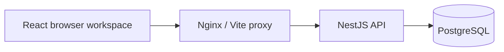

# FieldMate AI

**Talk to your machines. Remember every repair.**

FieldMate is a voice-first maintenance copilot that gives field technicians access to equipment knowledge and maintenance history, then turns repair conversations into structured records.

## Current build: Phase 4 — equipment lookup

The build includes the pnpm monorepo, equipment workspace, NestJS maintenance API, PostgreSQL migrations and seed, and the complete Docker Compose deployment path.

The dashboard displays real equipment, incident, reading, and repair records. The backend supports approved fault knowledge, gated procedures, incident notes/escalation, and atomic repair completion. Five simulated assets and two previous M-204/F0003 repairs are seeded. Voice now connects to AssemblyAI with browser microphone capture, streamed audio, live transcripts, mute, and interruption handling. The first voice tool, `find_asset`, searches the live equipment register and selects a unique match. Fault lookup, maintenance history, and write tools are next.

See [voice setup and testing](docs/voice.md) and [the maintenance API walkthrough](docs/maintenance-api.md) for request examples, integrity rules, and demo reset commands.

## Stack

- Node.js 24, TypeScript, pnpm 10
- React, Vite, Tailwind CSS, TanStack Query
- NestJS, Swagger, DTO validation
- PostgreSQL 17, Prisma 7 with the PostgreSQL driver adapter
- Docker Compose, Nginx
- AssemblyAI Voice Agent API

```text
apps/web          React equipment workspace + Nginx
apps/api          NestJS API + Prisma schema, migrations, and seed
packages/shared   Shared TypeScript contracts and Zod response schemas
```

## Start with Docker

Only Docker with Compose is required. From the repository root:

```sh
cp .env.example .env
docker compose up --build -d
docker compose exec api pnpm prisma:seed
```

Startup applies committed migrations automatically. Seeding is explicit and idempotent: it creates missing demo assets without overwriting existing records. Before seeding, the dashboard displays its empty state. No AssemblyAI key is needed for the maintenance backend.

| Service            | Local URL                           |
| ------------------ | ----------------------------------- |
| Dashboard          | http://localhost:5173               |
| API                | http://localhost:3000/api/v1/assets |
| API documentation  | http://localhost:3000/docs          |
| Database readiness | http://localhost:3000/health        |
| PostgreSQL         | localhost:5432                      |

The web container proxies `/api` to NestJS, so browser requests stay on the frontend origin. All published ports bind to localhost. Public deployment should place an HTTPS reverse proxy in front of the web service and set `FRONTEND_URL` to the public origin. Keep PostgreSQL private.



## Fast host development

Install Node.js 24 and enable Corepack. If `pnpm` is not on PATH, use `corepack pnpm` instead of `pnpm` below.

```sh
corepack enable
cp .env.example .env
cp apps/api/.env.example apps/api/.env
docker compose up -d postgres
pnpm install --frozen-lockfile
pnpm db:generate
pnpm --filter @fieldmate/api prisma:migrate:deploy
pnpm db:seed
pnpm dev
```

If the full Compose stack is already running, first stop its app containers with `docker compose stop api web` to free ports 3000 and 5173. Shared contracts compile before the dev processes start and are watched alongside the apps.

The root `.env` configures Compose. `apps/api/.env` configures the host API and Prisma CLI; its database URL uses `localhost`, while Compose uses the service hostname `postgres`. If you change database credentials or ports, update both files. Passwords embedded in a connection URL must be URL-encoded; the default Compose URL assumes URL-safe credentials.

`apps/web/.env.example` documents the optional public `VITE_API_BASE_URL` setting. The default `/api/v1` works through both Vite and Nginx. Never put privileged keys in a `VITE_` variable. The permanent AssemblyAI key belongs only in server runtime configuration.

## Database and operations

```sh
docker compose ps
docker compose logs -f api
docker compose exec api pnpm prisma:migrate:deploy
docker compose exec api pnpm prisma:seed
docker compose down
```

`docker compose down` preserves the named database volume. To reset **all local demo data**, explicitly remove the volume and reseed:

```sh
docker compose down -v
docker compose up --build -d
docker compose exec api pnpm prisma:seed
```

For schema changes during development, edit `apps/api/prisma/schema.prisma`, run `pnpm db:migrate --name descriptive_change`, regenerate the client, and commit the generated migration. Prisma schemas, migrations, seed data, and the pnpm lockfile belong in Git; generated clients and secrets do not.

## Validation

```sh
pnpm db:generate
pnpm build
pnpm typecheck
pnpm lint
pnpm format:check
pnpm test:voice
# Requires the API running with the demo seed applied:
pnpm test:integration
# Against the running frontend (install Chromium once):
pnpm exec playwright install chromium
pnpm test:e2e
```

Integration checks cover database health, canonical asset data, asset details, normalized search, missing assets, and input validation against the running PostgreSQL-backed API. Set `TEST_API_URL` to test another API origin.

Browser checks cover desktop/mobile asset selection, empty data, API failure and recovery, and horizontal overflow. Set `TEST_WEB_URL` to test another frontend origin, or `PLAYWRIGHT_CHANNEL=chrome` to use an installed Google Chrome instead of bundled Chromium.

## Isolated maintenance tests

The maintenance suite writes records and injects a PostgreSQL failure to prove rollback. It requires a freshly seeded separate test database; never point it at the working demo.

```sh
cp .env.test.example .env.test
docker compose build
docker compose --env-file .env.test -p fieldmate-test -f docker-compose.yml -f docker-compose.test.yml up -d --no-build --wait
docker compose --env-file .env.test -p fieldmate-test -f docker-compose.yml -f docker-compose.test.yml exec api pnpm seed:reset --confirm
pnpm test:maintenance
# Remove only the test containers and test volume when finished:
docker compose --env-file .env.test -p fieldmate-test -f docker-compose.yml -f docker-compose.test.yml down -v
```

Tests exercise the canonical repair, concurrent incident numbers, identical completion retries, cross-asset validation, other active incidents, approved-knowledge gates, simulated escalation, and rollback after an injected database error. Test ports are 53000 (API), 55173 (web), and 55432 (PostgreSQL).

## Demo and next phases

The primary scenario follows M-204 through an F0003 fault: retrieve previous incidents, record 347 V, open a high-priority incident, then capture a loose-L2 repair with a 12.4 A verification measurement. A later history query should retrieve that new repair.

1. **Phase 1:** workspace, Docker, database, and seeded asset dashboard.
2. **Phase 2:** fault knowledge, incidents, measurements, and transactional repair completion.
3. **Phase 3:** AssemblyAI authentication, microphone capture, transcripts, audio playback, and interruption handling.
4. **Phase 4:** voice tools connected to the maintenance backend.
5. **Phase 5:** product polish and responsive workflow refinements.
6. **Phase 6:** repeated demo validation and public HTTPS deployment.

## Safety and data

All equipment specifications and procedures in the demo are simulated references, not manufacturer documentation. FieldMate provides maintenance decision support; it will not control equipment. Procedural guidance must use approved knowledge and require the appropriate safe-state confirmation. Unknown faults should lead to documentation and escalation.

The MVP uses a demo technician without authentication. Authentication and access controls are required before using real customer maintenance data.
