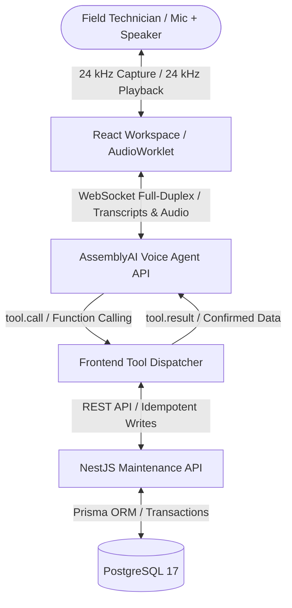

# FieldMate AI

> **Talk to your machines. Remember every repair.**
>
> FieldMate AI is a voice-first maintenance copilot that gives industrial field technicians hands-free access to equipment knowledge, model-specific fault definitions, and past maintenance history while automatically turning repair conversations into structured institutional knowledge.

---

## The Problem

Industrial maintenance knowledge is fragmented across PDF manuals, CMMS tickets, paper logs, WhatsApp messages, and senior technicians' memories. When critical plant equipment trips:

1. **Slow Troubleshooting:** Technicians waste valuable production minutes flipping through manuals, logging into clunky software, or searching for senior colleagues.
2. **Hands-Occupied Reality:** Field technicians work with gloves on, tools in hand, multimeters probing contacts, and loud background ambient noise. Typing into a mobile screen or laptop is impractical and dangerous.
3. **Institutional Knowledge Loss:** Documentation happens late or incompletely. Once a difficult intermittent fault is fixed, the root cause and diagnostic reasoning often leave the plant with the technician instead of being recorded for the next shift.

---

## The Solution

FieldMate AI introduces a voice-first interface directly to the plant's operational systems and maintenance memory:

- **Hands-Free Troubleshooting:** Speak naturally to query equipment, lookup drive fault codes, recall past incidents, and log readings without setting tools down.
- **Safety First:** Approved repair procedures for high-voltage or mechanical systems are strictly gated behind an explicit on-screen safe-state confirmation in the technician workspace.
- **Voice-to-Structured Records:** Natural spoken wrap-ups (_"Fixed it. Loose L2 terminal. Tightened it. Motor is now drawing 12.4 amps."_) are atomically converted into structured incident records, telemetry measurements, and permanent maintenance history.
- **Institutional Memory:** The moment a repair is logged, it becomes searchable knowledge for any future technician encountering that same machine or fault code.

---

## Architecture

FieldMate uses a streaming TypeScript architecture connecting a React/Vite audio workspace, AssemblyAI's real-time Voice Agent API over WebSockets, a NestJS maintenance backend, and PostgreSQL with Prisma transactions.



### Voice Pipeline Highlights

- **Capture:** Browser `AudioWorkletNode` resamples microphone input to the Voice Agent API's 24 kHz PCM stream.
- **Playback:** Incoming 24 kHz raw PCM audio buffers are scheduled seamlessly on an `AudioContext` with sub-millisecond precision.
- **Barge-In / Interruption:** When the technician speaks while the agent is responding, AssemblyAI turn detection triggers an immediate client-side audio queue flush.
- **Zero Credential Exposure:** Browser clients never receive the permanent `ASSEMBLYAI_API_KEY`. Single-use temporary tokens with a 60-second TTL are minted by the NestJS backend via `POST /api/v1/voice/token`.

---

## Key Features

1. **9 Connected Operational Voice Tools:**
   - `find_asset`: Search plant equipment by tag (`M-204`), model, or location with speech-normalization.
   - `lookup_fault_code`: Model-specific fault definition lookup (e.g. `F0003` Undervoltage on Siemens SINAMICS G120).
   - `get_maintenance_history`: Retrieves previous repairs, recurring fault counts, and past technician observations.
   - `get_approved_procedure`: Retrieves site-approved troubleshooting steps requiring physical workspace safe-state confirmation.
   - `record_measurement`: Hands-free logging of electrical and mechanical telemetry (e.g. `347 V`).
   - `create_incident`: Opens high-priority incidents with human-readable numbers (`INC-1048`).
   - `resolve_incident` / `complete_repair`: Atomic transaction completing repair, logging root cause, action taken, verification reading, and restoring machine status.
   - `escalate_incident`: Marks unresolvable or dangerous faults for supervisor attention.
   - `add_incident_note`: Appends timestamped field notes to the incident audit log.

2. **Institutional Memory Graph:**
   - Interactive relationship tree in the workspace connecting equipment roots $\to$ recurring fault occurrences $\to$ historical root causes $\to$ latest verification telemetry readings.

3. **Field Tag Selector:**
   - Camera viewfinder with target reticle, direct `fieldmate://asset/M-204` URI entry, and one-click demo machine tags for instant asset selection without speaking. Camera-frame QR decoding is a remaining stretch feature.

4. **Supervisor Telemetry & Incident Register:**
   - Real-time dashboard metric cards (Active Incidents, Equipment Down, Resolved Repairs, Recurring Faults).
   - Cross-plant Incident Register drawer with status filtering (`Active`, `⚠️ Escalated`, `Resolved`) and search.
   - Drill-down Incident Detail modal showing full audit notes, telemetry, and repair records.

---

## Canonical Demo Scenario (7-Scene Walkthrough)

The canonical demonstration follows Conveyor Drive Motor **`M-204`** through an **`F0003`** drive trip:

1. **Scene 1 (Asset Identification):** Technician says: _"FieldMate, motor M-204 just tripped. The drive shows F0003."_ FieldMate runs `find_asset` and `lookup_fault_code`, identifies the Siemens drive, and reports an undervoltage condition.
2. **Scene 2 (Equipment Memory):** FieldMate checks history via `get_maintenance_history` and informs the technician: _"This machine had the same fault twice recently. Previous incidents were linked to low incoming voltage."_
3. **Scene 3 (Safety Gating):** FieldMate requests physical safety confirmation before providing procedure steps: _"Before we proceed, confirm the equipment is stopped and in a safe state."_ Technician confirms; procedure steps unlock.
4. **Scene 4 (Measurement Logging):** Technician measures drive input voltage: _"I'm measuring 347 volts."_ FieldMate calls `record_measurement`, detects the reading is below the 400 V nominal rating, and offers to open an incident.
5. **Scene 5 (Incident Creation):** Technician agrees; FieldMate calls `create_incident`, generating high-priority incident **`INC-1048`**.
6. **Scene 6 (Barge-in / Interruption):** While FieldMate explains wiring checks, technician spots the physical fault and interrupts: _"Wait, I found it — loose L2 terminal."_ FieldMate stops speaking immediately and listens.
7. **Scene 7 (Repair Completion & Searchable Memory):** Technician tightens the connection: _"Loose L2 terminal tightened. Motor restarted, now drawing 12.4 amps."_ FieldMate executes atomic repair completion. `M-204` returns to operational status, `INC-1048` is marked resolved, and subsequent history queries retrieve this repair record.

---

## Tech Stack

- **Frontend:** React 19, TypeScript, Vite, Tailwind CSS, TanStack Query, Lucide Icons, Web Audio API / AudioWorklet.
- **Backend:** NestJS 11, Node.js 24, TypeScript (strict), Swagger OpenAPI, class-validator, DTO validation.
- **Database & ORM:** PostgreSQL 17, Prisma 7 with PostgreSQL driver adapter (`@prisma/adapter-pg`).
- **Voice Agent Engine:** AssemblyAI Voice Agent API (WebSocket, streaming speech recognition, LLM reasoning, 24 kHz TTS, function calling).
- **Infrastructure:** Docker Compose, Nginx reverse proxy, pnpm workspaces.

---

## Quickstart with Docker

Only Docker and Docker Compose are required:

```sh
# 1. Clone repository and set environment variables
cp .env.example .env

# Optional: Add your ASSEMBLYAI_API_KEY to .env for live voice
# ASSEMBLYAI_API_KEY=your_key_here

# 2. Build and launch services
docker compose up --build -d

# 3. Seed the Plant Alpha equipment dataset
docker compose exec api pnpm prisma:seed

# Useful operations
docker compose logs -f api
docker compose exec api pnpm prisma:migrate:deploy
docker compose down

# Destructive local reset: removes the PostgreSQL volume
docker compose down -v
```

### Local URLs

| Service                   | Local URL                                                                  | Description                                              |
| :------------------------ | :------------------------------------------------------------------------- | :------------------------------------------------------- |
| **Technician Workspace**  | [http://localhost:5173](http://localhost:5173)                             | Main UI (voice orb, equipment list, timeline)            |
| **Supervisor Workspace**  | [http://localhost:5173/supervisor](http://localhost:5173/supervisor)       | Escalation queue, assignment, priority, and review notes |
| **Administration Space**  | [http://localhost:5173/admin](http://localhost:5173/admin)                 | Users, sites, assets, fault codes, SOPs, and audit trail |
| **REST API**              | [http://localhost:3000/api/v1/assets](http://localhost:3000/api/v1/assets) | Equipment and maintenance API endpoints                  |
| **Swagger Documentation** | [http://localhost:3000/docs](http://localhost:3000/docs)                   | Interactive API explorer                                 |
| **Readiness & Health**    | [http://localhost:3000/health](http://localhost:3000/health)               | Database and API readiness check                         |
| **PostgreSQL**            | `localhost:5432`                                                           | Database port                                            |

---

## Fast Host Development

```sh
# Enable pnpm
corepack enable
pnpm install --frozen-lockfile

# Start PostgreSQL
docker compose up -d postgres

# Configure environment
cp .env.example .env
cp apps/api/.env.example apps/api/.env

# Generate Prisma client and seed
pnpm db:generate
pnpm --filter @fieldmate/api prisma:migrate:deploy
pnpm db:seed

# Launch all dev servers
pnpm dev
```

---

## Validation & Test Suite

FieldMate includes comprehensive test suites covering contracts, voice protocols, role-based access, and the administrative lifecycle:

```sh
# 1. Unit & Voice Tool Tests (22 passing tests)
pnpm test:voice

# 2. Authentication & Session Lifecycle (6 passing tests)
pnpm test:auth

# 3. Role-Based Access Control & Multi-Site Scoping (7 passing tests)
pnpm test:rbac

# 4. User Administration & Invitations (8 passing tests)
pnpm test:admin

# 5. Site & Machine Inventory Administration (4 passing tests)
pnpm test:admin:resources

# 6. Fault Code & Procedure SOP Administration (4 passing tests)
pnpm test:admin:knowledge

# 7. Audit Trail & Session Cleanup (4 passing tests)
pnpm test:admin:audit

# 8. Maintenance transaction tests against an isolated test stack (9 passing tests)
pnpm test:maintenance

# 9. Automated Canonical Demo API Simulation
pnpm demo:api

# 10. Browser E2E suite against a running stack
pnpm test:e2e

# 11. Canonical browser voice-write path against a freshly reset isolated stack
pnpm test:e2e:writes

# 12. Typecheck, Lint, and Format Verification
pnpm typecheck
pnpm lint
pnpm format:check
pnpm build

# 13. Optional Live Voice Provider Smoke Test (requires ASSEMBLYAI_API_KEY)
pnpm test:voice:live

# Full live provider write path; use only with a freshly reset isolated stack
TEST_WEB_URL=http://localhost:55173 pnpm test:voice:live:writes
```

The write-path, maintenance, and administrative tests target an isolated test database. Start it before running those commands:

```sh
cp .env.test.example .env.test
docker compose --project-name fieldmate-test --env-file .env.test \
  -f docker-compose.yml -f docker-compose.test.yml up -d --wait
docker compose --project-name fieldmate-test --env-file .env.test \
  -f docker-compose.yml -f docker-compose.test.yml exec api pnpm prisma:seed

# Run isolated tests using the URLs from .env.test
pnpm test:maintenance
pnpm test:admin:audit
pnpm test:e2e:writes

# Restore the canonical scenario after write tests
docker compose --project-name fieldmate-test --env-file .env.test \
  -f docker-compose.yml -f docker-compose.test.yml exec api pnpm seed:reset --confirm
```

The supervisor workspace turns a technician escalation into a tracked review. A
supervisor can acknowledge the pending escalation, assign an eligible user,
change priority, and add an attributed note without resolving the technician's
incident. Repair completion remains the only operation that resolves the
incident and its escalation. See [docs/supervisor.md](docs/supervisor.md).

The multi-tenant authentication, RBAC, and administration workspace is documented in
[docs/auth-rbac-admin-implementation-plan.md](docs/auth-rbac-admin-implementation-plan.md).
All phases (Phase 1 through 7) are fully implemented and verified. Deployment and
security foundation details are in [docs/security-foundation.md](docs/security-foundation.md).

The responsive field experience and mobile technician work are planned in
[docs/field-technician-mobile-ui-plan.md](docs/field-technician-mobile-ui-plan.md).

### Demo Reset Command

To reset the database back to the canonical pre-demo state (clean M-204, only 2 historical repairs, no `INC-1048`):

```sh
pnpm --filter @fieldmate/api seed:reset --confirm
# Or via Docker:
docker compose exec api pnpm seed:reset --confirm
```

---

## Safety Design & Human-in-the-Loop

FieldMate is an industrial **decision-support copilot**, not an autonomous PLC or machine controller:

1. **No Autonomous Energization:** FieldMate never sends machine start, stop, or breaker control signals.
2. **Safety-State Confirmation:** Troubleshooting steps for hazardous electrical or mechanical systems cannot be retrieved until the technician explicitly confirms the safe maintenance state in the workspace. Voice conversation alone cannot satisfy this gate.
3. **No Hallucinated Procedures:** If a fault code is unverified or no approved procedure exists, FieldMate explicitly refuses to invent steps and offers to log an incident for supervisor escalation.
4. **On-Screen Confirmation:** Write operations (incidents, measurements, and repairs) present an interactive preview before committing to the database.

---

## Business Model & Defensibility

- **Target Market:** Industrial manufacturing plants, facilities management, water treatment facilities, and renewable energy sites.
- **Pricing Model:** B2B SaaS per active technician / per connected plant site.
- **Competitive Moat:** Traditional CMMS tools (SAP PM, Maximo) are desktop/form-heavy systems of record that suffer from poor field compliance. Generic voice assistants lack equipment-specific safety rules and database write integrity. FieldMate bridges both by converting daily field speech into institutional memory.

---

## Future Roadmap

- [ ] Enterprise CMMS two-way connectors (SAP PM, IBM Maximo, MaintainX).
- [x] Multi-tenant organization support and role-based access control (RBAC).
- [ ] Thermal camera and computer vision integration for AR smart-glasses.
- [ ] Native vibration and acoustic anomaly telemetry feeds.
- [ ] Multi-lingual speech translation for diverse global manufacturing crews.

---

## Hackathon Submission Highlights

- **AssemblyAI Voice Agent API:** Full-duplex WebSocket streaming, low-latency ASR, voice activity detection, barge-in / interruption handling, and 9 registered function tools.
- **Domain Keyterm Boosting:** Custom vocabulary hints (`M-204`, `F0003`, `SINAMICS`, `VFD`, `undervoltage`) configured in the session.
- **Deterministic Testability:** Automated unit, API integration, browser, and canonical voice-write coverage with isolated database seed and reset workflows.
